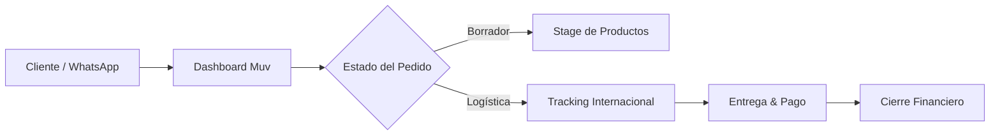

# 📦 Muv — Logistics & Business Intelligence Ecosystem

**Muv** es una solución de software empresarial diseñada para automatizar y optimizar la cadena de suministro de importaciones internacionales (China → USA → Venezuela). El ecosistema permite a los operadores gestionar la complejidad de pedidos multi-cliente, consolidación de carga y conciliación financiera en una sola interfaz premium.

---

## 🚀 El Problema y la Solución

### El Desafío
La gestión manual de importaciones implica lidiar con múltiples proveedores, tiempos de tránsito inciertos, pagos fraccionados (esquemas 50/50) y la consolidación de productos de diferentes clientes en un solo envío internacional.

### La Solución Muv
Muv centraliza esta operación mediante un **flujo de estados inteligente** y un **motor de cálculo financiero** que garantiza que cada dólar y cada paquete estén perfectamente trazados desde la tienda en origen hasta la mano del cliente final.

---

## ✨ Características de Alto Nivel

### 🌀 Gestión Logística de Ciclo Completo
Seguimiento granular a través de un pipeline de 8 estados operativos:
- **Borrador (Stage)**: Consolidación de ítems multi-cliente.
- **Tránsito Internacional**: Monitoreo de tramos China → USA y USA → Venezuela.
- **Entrega Final**: Validación de recepción y cierre de ciclo.

### 💰 Inteligencia Financiera
- **Cálculo de Ganancia Neta**: Fórmulas automatizadas que consideran costo real, margen variable y envío personalizado por cliente.
- **Sistema de Pagos 50/50**: Gestión de saldos parciales, totales y alertas de pagos pendientes.
- **Dashboard de Métricas**: Visualización en tiempo real de ingresos proyectados, cobrados y volumen de pedidos.

### 📱 Experiencia de Usuario (UX) Pro
- **Mobile-First Design**: Optimizada para la gestión en movimiento mediante una interfaz responsiva de alta densidad.
- **Hub de Comunicación**: Enlaces directos a WhatsApp para cada cliente, facilitando el seguimiento y la fidelización.
- **Design System Maestro**: Interfaz basada en tokens `oklch`, garantizando consistencia visual y soporte nativo para **Dark Mode**.

---

## 🛠️ Arquitectura Técnica

### Core Stack
| Capa | Tecnología | Propósito |
|---|---|---|
| **Frontend** | Next.js 15 + React 19 | Arquitectura de componentes moderna y Server Components. |
| **Styling** | Tailwind CSS v4 | Estilizado basado en tokens y optimización en tiempo de build. |
| **Backend** | Cloud Firestore | Base de datos NoSQL en tiempo real para sincronización inmediata. |
| **Auth** | Firebase Auth | Autenticación robusta con Google Sign-In y Email/Password. |
| **State** | Zustand | Gestión de estado global ligero y eficiente. |

### Flujo de Datos

---

## 🎨 Sistema de Diseño (Muv UI)

El lenguaje visual de Muv se basa en el refinamiento y la claridad:
- **Tipografía**: Inter para legibilidad y JetBrains Mono para datos financieros.
- **Paleta**: Basada en los colores de marca del logo (`#7B5EA7` Púrpura y `#B8A9D4` Lavanda).
- **Componentes**: Librería personalizada construida sobre **shadcn/ui**.

---

**Desarrollado por Juan17md**
